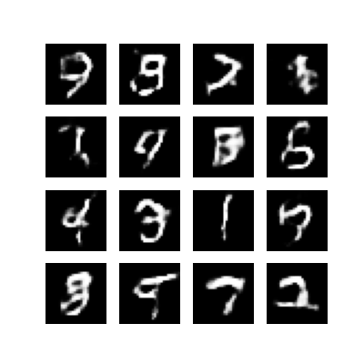
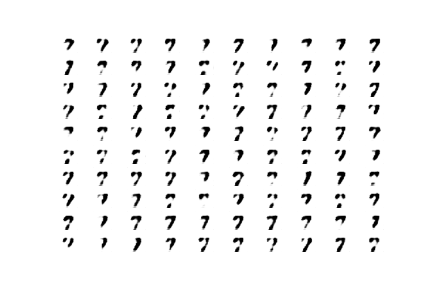
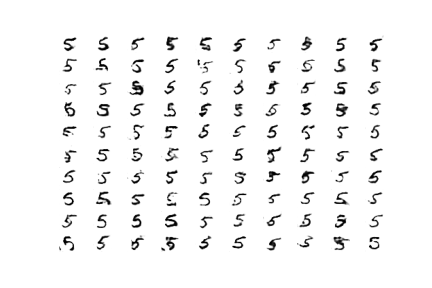
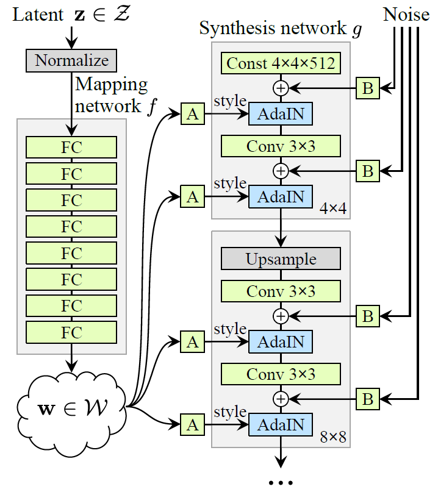
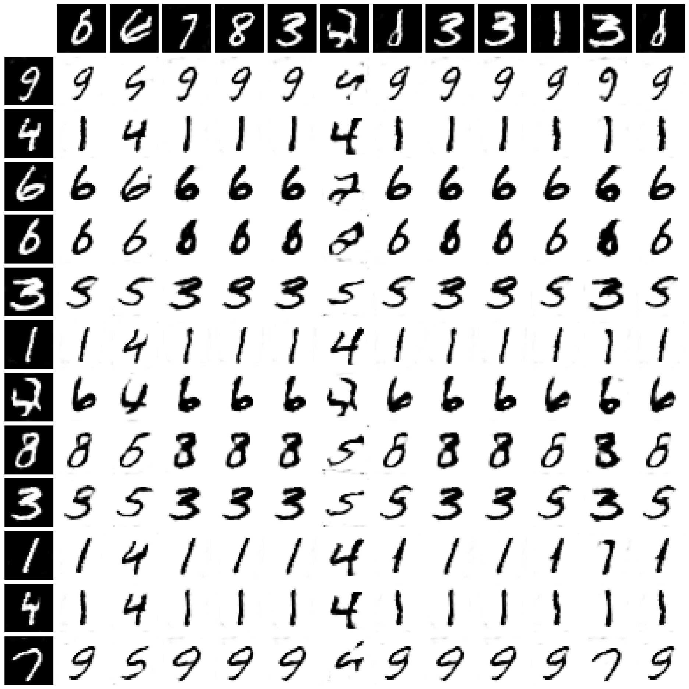
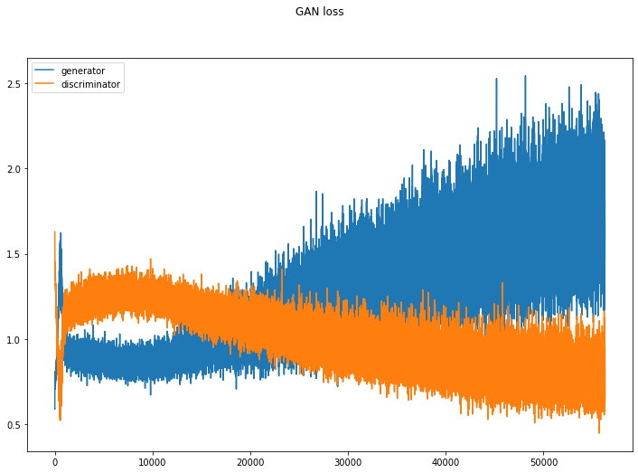

# Analysis of different GAN architectures based on MNIST Dataset

Tensorflow implementation of different Generative Adversarial Networks (DCGAN, WGAN, LSGAN, InfoGAN, StyleGAN) on MNIST dataset.

---

## Overview

The project lays importance on training 5 different GAN approaches practiced in the field of machine
learning currently, understanding the loss curve of each and every one of them, and also producing the generative output of the MNIST handwritten dataset with saved `ckpt` pre-trained models. The five networks trained so far were implemented using Tensorflow 2.0 framework and are listed in the order as shown.

* ✅ Deep Convolutional Generative Adversarial Network (DCGAN)
* ✅ Wasserstein Generative Adversarial Network (WGAN)
* ✅ Least Squares Generative Adversarial Networks (LSGAN)
* ✅ Information Maximizing Generative Adversarial Network (InfoGAN)
* ✅ Style GAN

---

## Tech Stack

- **Language:** `Python`
- **Libraries:** `tensorflow`, `keras`, `numpy`, `matplotlib`, `imageio`, `matplotlib`, `tensorflow_probability`, `os` 

---

### DCGAN

DCGAN is the vanilla form of a Generative
Adversarial Network. They use convolutional and
convolutional-transpose layers in the generator and
discriminator respectively. The figure below shows the output of the network after training.

---

---
### WGAN

The Wasserstein Generative Adversarial Network (WGAN) introduces a novel training methodology specifically tailored for prevalent GAN datasets. In this framework, the traditional discriminator is rebranded as a "critic." Unlike conventional GANs that employ a classification approach (assigning scores of 1 or 0), the critic in WGAN provides a score indicating the degree of realness or fakeness of the generated data.

Most GAN approaches typically utilize the Kullback-Leibler (KL) divergence for optimizing the model. However, this method exhibits flaws when the probability distribution Q(x) equals 0 at a point where P(x) is greater than 0, causing the divergence to approach infinity. WGAN addresses this issue by introducing a new distance metric known as the Earth Mover Distance.

Mathematically, the Earth Mover Distance can be formulated as the supremum taken over all 1-Lipschitz functions. This approach overcomes the divergence-related challenges associated with traditional GANs, providing a more stable optimization process. The WGAN's use of the Earth Mover Distance enhances the model's ability to generate realistic data by considering the optimal transportation of mass from the distribution of real data to the generated data.

This paradigm shift in distance metric not only resolves convergence issues but also offers a more robust and effective training approach for GANs, particularly when dealing with common datasets. The WGAN's innovative methodology is expected to contribute to advancements in generative models within the deep learning community. Figure below shows the convergence curve and algorithm overview.

---

---

### WGAN

Typically, minimizing the objective function of regular
GANs suffer from vanishing gradients for the samples
that are on the correct side of the decision boundary,
but are still far from the real data., which makes it
hard to update the generator. Since LSGANs adopt least
squares loss function for the discriminator to remedy
this problem it is able to move the fake samples toward the decision boundary, because the least squares loss function penalizes samples that lie in a long way on the correct side of the decision boundary. Another benefit of LSGANs is the improved stability of learning process. The LSGAN convergence curve and output are shown below.

---
### StyleGAN

The Style Generative Adversarial Network is an
extension to the GAN architecture that proposes
significant changes to the generator model, including
the use of a mapping network to map points in latent
space to an intermediate latent space. It also uses an
intermediate latent space to control style at each point in the generator model while introducing noise as a source of variation at each point in the generator model. The resultant model is capable of not only creating remarkably photo-realistic high-quality images of faces, but also of providing control over the style of the created image at different degrees of detail by adjusting
the style vectors and noise.

The StyleGAN generator no longer accepts a latent
space point as input; instead, it employs two new
randomness sources to create a synthetic image: an
independent mapping network and noise layers. The
output of the mapping network is a vector defining
the styles that are combined at each point in the
generator model via a new layer called adaptive instance normalization. This style vector gives control over the style of the resultant picture. Stochastic variation is introduced through noise added at each point in the generator model. The noise is added to entire feature maps that allow the model to interpret the style in a fine-grained, per-pixel manner.

#### Architecture

#### Convergence curve

#### Generated Output

---
### InfoGAN
Information Maximizing GAN is another important
development in the field of Deep Generative modeling.
In general, the generator model takes random noise from
latent space that typically limits gaussian variables and
they apply during the training phase to generate the
images from the real distribution Pr. The Info GAN
was proposed to give some control variable as input
to the generator along with the latent space noise in
order to constrain the generator to learn the relation
between the latent space and these constraint variables as
well. Consequently, the idea is to use this set of control
variables to influence specific properties of the generated
images. Mutual information refers to the amount of
information learned about one variable and shared with
another variable, specifically in this problem the question
of interest is the information about the control variables
given the image generated using noise and the control
variables.

The paper uses a separate model called Q (Auxilliary
model) to train the generator via mutual information,
but the auxiliary model predicts the control codes than
working with real or fake images. The loss function
should have the component of mutual information
on the Gaussian control codes. The Q model can
implement the prediction of continuous control variables
with a Gaussian distribution, where the output layer is
configured to have one node, mean, and one node for
standard deviation. The paper uses a separate model
called Q (Auxilliary model) to train the generator via
mutual information, but the auxiliary model predicts the
control codes than working with real or fake images.
The loss function should have the component of mutual
information on the Gaussian control codes. The Q model
can implement the prediction of continuous control
variables with a Gaussian.

---

#### Convergence curve

---

#### Categorical Control Input Variation

---

#### First Continuous Input Variation - Rotation

---

#### Second Continuous Input Variation - Thickness

---